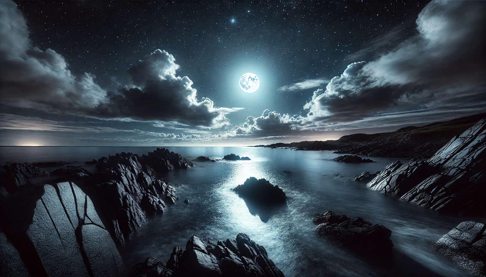
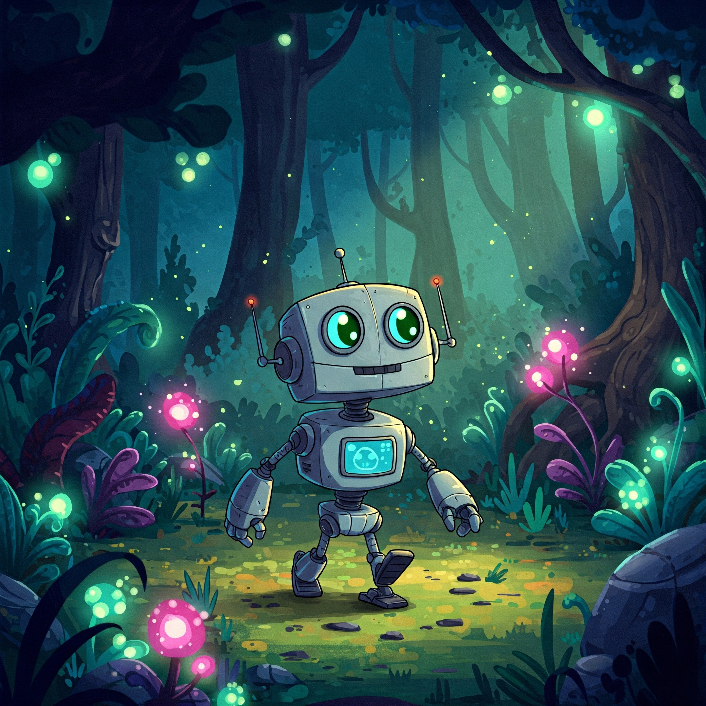
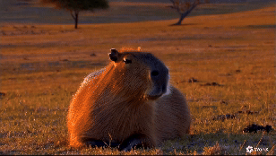

# Explorando a Inteligência Artificial Generativa e Multimodal

## Descrição

Este projeto é uma exploração das capacidades da inteligência artificial generativa, com foco em modelos que não apenas criam imagens, mas também realizam diversas outras tarefas, como geração de texto, código e muito mais. O objetivo é demonstrar a versatilidade dessas tecnologias e discutir suas aplicações.

## O Que é IA Generativa e Multimodal?

A IA generativa e multimodal representa um avanço significativo na inteligência artificial, permitindo a criação de conteúdos diversos a partir de diferentes tipos de dados. Esses modelos aprendem padrões complexos e estruturas em grandes conjuntos de dados, possibilitando a geração de texto, imagens, áudio, vídeo e até mesmo código.

## Modelos de IA Generativa e Multimodal

Além dos modelos focados em geração de imagens, como DALL-E 2, Midjourney e Stable Diffusion, existem outros modelos que abrangem uma gama mais ampla de tarefas:

* **Gemini (Google):** Gemini é uma família de modelos de inteligência artificial multimodal desenvolvida pelo Google. Ele é projetado para ser altamente flexível e capaz de lidar com diferentes tipos de dados, incluindo texto, código, imagens e vídeo. O Gemini é capaz de gerar texto, traduzir idiomas, escrever diferentes tipos de conteúdo criativo e responder às perguntas de forma informativa.
* **GPT (OpenAI):** Uma família de modelos de linguagem que pode gerar texto, traduzir idiomas, escrever diferentes tipos de conteúdo criativo e responder às suas perguntas de forma informativa.
* **Copilot (GitHub):** Um assistente de codificação baseado em IA que ajuda os desenvolvedores a escrever código de forma mais rápida e eficiente.
* **Azure OpenAI (Microsoft):** Uma plataforma que oferece acesso aos modelos OpenAI, permitindo que desenvolvedores criem aplicações com IA generativa.
* **Grok (xAI):** Modelo de linguagem de grande porte da XAI.

## Exemplos de Uso

As IAs generativas e multimodais têm diversas aplicações, como:

* **Criação de Conteúdo:** Geração de artigos, posts de blog, roteiros, poemas, músicas e outros tipos de conteúdo criativo.
* **Assistência Virtual:** Desenvolvimento de chatbots e assistentes virtuais mais inteligentes e capazes de realizar tarefas complexas.
* **Tradução e Interpretação:** Tradução de idiomas em tempo real, interpretação de textos e áudios.
* **Geração de Código:** Auxílio no desenvolvimento de software, geração de código a partir de descrições textuais.
* **Design e Arte:** Criação de imagens, vídeos, animações e outros tipos de conteúdo visual.

## Testes

Para demonstrar as capacidades dos modelos de IA generativa e multimodal, realizamos alguns testes práticos:

### 1. Descrição e Geração de Imagem

* Fornecemos a seguinte imagem para o modelo:
   
* O modelo gerou a seguinte descrição: "A imagem exibe um pôr do sol deslumbrante sobre uma paisagem costeira. O céu está pintado com tons vibrantes de laranja, rosa e amarelo, refletindo-se na água rasa entre as rochas. O mar está calmo, e as formações rochosas na frente adicionam textura e profundidade à cena. No horizonte, há uma silhueta de edifícios e algumas nuvens que enriquecem a composição."
* Pedi para recriar a mesma paisagem mas a noite e descrevê-la, o modelo gerou a seguinte imagem e descrição: 
 
* "A cena agora é banhada pela luz prateada da lua cheia, que se reflete suavemente sobre o oceano e as rochas molhadas. O céu é um profundo azul escuro, repleto de estrelas cintilantes e algumas nuvens esparsas, que captam sutilmente o brilho lunar. As ondas tocam delicadamente a costa, e a textura das rochas, agora úmidas, brilha sob a iluminação noturna. No horizonte, há um leve brilho de luzes distantes, dando um toque de calor ao cenário sereno e misterioso."
### 2. Geração de Imagem a partir de Descrição

* Fornecemos a seguinte descrição para o modelo: "Um robô amigável explorando uma floresta mágica, estilo desenho animado."
* O modelo gerou a seguinte imagem: 
  
### 2. Geração de Video a partir de Descrição

* Fornecemos a seguinte descrição para o modelo: "Em um vasto campo dourado, sob o brilho quente do pôr do sol, uma capivara repousa tranquilamente. De repente, um gato malhado se aproxima, curioso e brincalhão. Ele se esfrega na capivara, que responde com um olhar calmo e amigável. Os dois amigos desfrutam da companhia um do outro enquanto a luz suave do entardecer pinta a paisagem com tons quentes de laranja e dourado. A câmera captura a interação delicada e afetuosa entre os animais, transmitindo uma sensação de paz e harmonia em meio à serenidade do campo ao entardecer."
* O modelo gerou o video, o video foi convertido em gif pra poder ser exibido:
    

## Implicações e Considerações

O avanço das IAs generativas e multimodais levanta questões importantes, como:

* **Ética e Responsabilidade:** Como garantir que essas tecnologias sejam usadas de forma ética e responsável?
* **Viés e Discriminação:** Como evitar que os modelos reproduzam vieses e discriminações presentes nos dados de treinamento?
* **Impacto no Mercado de Trabalho:** Como essas tecnologias podem afetar diferentes profissões e setores da economia?

